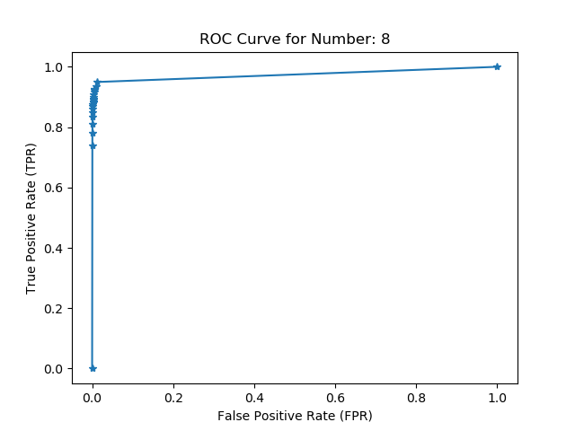

# Neural Nets and Deep Learning
This library is used for learning about neural networks. Reading material is from [Neural Nets and Deep Learning](http://neuralnetworksanddeeplearning.com/chap1.html) and original source code is from [this repository](https://github.com/mnielsen/neural-networks-and-deep-learning.git).

## Pt. 1: Reading Textbook
## Pt. 2: Implement Neural Network
## Pt. 3a: Confusion Matrix
- Code for the confusion matrix can be found [here](/src/network.py) in the `evalution` function.

## Pt. 3b: Visualize Incorrect Predictions
- Code to visualize incorrect predictions can be found [here](src/network.py) in the `transform_digit` function.
- For example, this number is a 9 but was predicted as a 7:

## Pt. 3c: Save and Load Models
- Code to save and load pretrained models can be found [here](src/network.py) in the `save_network` and `load_network` functions.
- The `/src/pretrained_models` folder contains some pretrained models used during this project.

## Pt. 4: ROC Curves
- The code to implement an ROC curve can be found [here](src/network.py) in the `roc` function.

## Pt. 5: Hyperparameter Experimentation
- The experiments and their results can be found [here](hyperparam_exp.pdf).

**Acknowledgements** 
